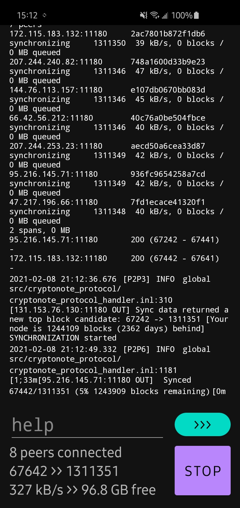

# aeond-app
 
Download and synchronize with the AEON network. This is the node for [aeon-wallet-app](https://github.com/yorha-0x/aeon-wallet-app) but can be run standalone as well. 

## Installation

* Enable install from unknown sources in Android configuration (Settings -> Security). 
* Download the app in the [release section](https://github.com/yorha-0x/aeond-app/releases).

## Build it yourself

* Get AEON on https://github.com/aeonix/aeon.
* [Build binaries for arm64-v8a and armeabi](https://github.com/BigslimVdub/AeonAndroidArmV8).
* Replace the compiled aeond binary under app/libs with the appropriate names such as `libxxxxx.so`
* Import and build with android studio. 

## License

Licensed under the Apache License, Version 2.0.
http://www.apache.org/licenses/LICENSE-2.0

